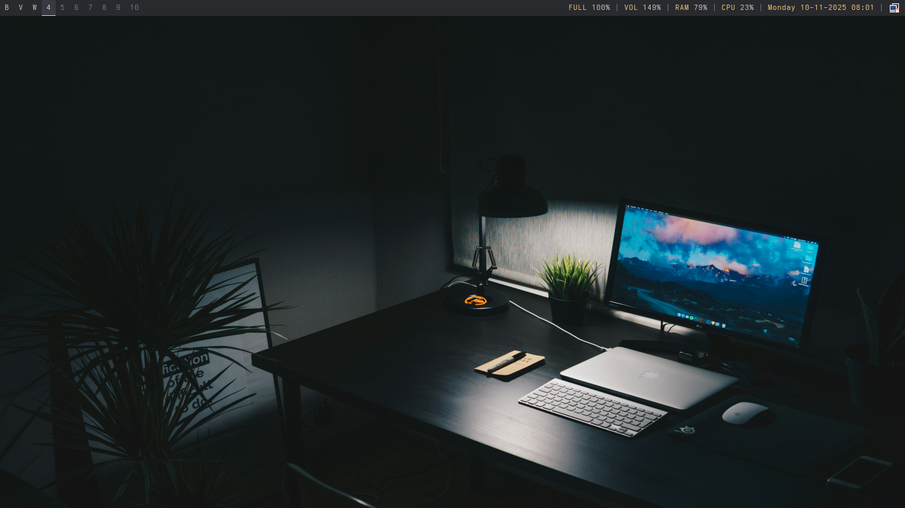

# Arch Linux + bspwm Configuration

This repository contains my custom configuration files for a minimal and efficient Arch Linux setup using bspwm as the window manager.

## Programs and Utilities

### Window Manager & Core

#### bspwm

- **Purpose**: Tiling window manager
- **Description**: A lightweight, minimal window manager that arranges windows in a binary tree structure
- **Config Location**: `.config/bspwm/bspwmrc`
- **Features**:
  - 10 workspaces (B, V, W, 4-10)
  - Auto-launches: sxhkd, polybar, dunst, flameshot, nm-applet, feh
  - Window rules for Chrome (workspace B) and VS Code (workspace V)

#### sxhkd

- **Purpose**: Hotkey daemon
- **Description**: Simple X hotkey daemon that manages all keyboard shortcuts
- **Config Location**: `.config/sxhkd/sxhkdrc`
- **Key Bindings**:
  - `Super + b` - Launch Chrome
  - `Super + v` - Launch VS Code
  - `Super + Shift + f` - Launch Thunar file manager
  - `Super + Return` - Launch Alacritty terminal
  - `Super + x` - Lock screen (i3lock)
  - `Super + Space` - Application launcher (dmenu)
  - `Print` - Full screen screenshot
  - `Super + Print` - Interactive screenshot
  - `Super + =/-` - Volume control
  - `Super + e` - Toggle mute
  - `Super + Alt + q/r` - Quit/restart bspwm

### Display & Visual

#### Polybar

- **Purpose**: Status bar
- **Description**: Highly customizable status bar for displaying system information
- **Config Location**: `.config/polybar/config.ini`
- **Modules**:
  - Workspaces (xworkspaces)
  - Window title
  - Battery status
  - Volume (PulseAudio)
  - RAM usage
  - CPU usage
  - Date & time (with day name)
  - System tray (for nm-applet, etc.)
- **Launch Script**: `.config/polybar/launch.sh`

#### feh

- **Purpose**: Wallpaper setter
- **Description**: Lightweight image viewer used for setting desktop wallpapers
- **Config Location**: `.config/feh/fehbg`
- **Features**:
  - Automatically loads first image from `~/Pictures/Wallpapers/`
  - Restores wallpaper on startup

### Applications

#### Alacritty

- **Purpose**: Terminal emulator
- **Description**: GPU-accelerated terminal emulator written in Rust
- **Installation**: `pacman -S alacritty`

#### Google Chrome

- **Purpose**: Web browser
- **Package**: `google-chrome-stable`
- **Auto-opens**: Workspace B

#### Thunar

- **Purpose**: File manager
- **Description**: Fast and lightweight file manager for XFCE
- **Installation**: `pacman -S thunar gvfs`
- **Features**: Trash support, file properties, external device management

### Utilities

#### Flameshot

- **Purpose**: Screenshot tool
- **Description**: Powerful and user-friendly screenshot software
- **Config Location**: `.config/flameshot/`
- **Features**:
  - Full screen capture
  - Interactive area selection
  - Built-in annotation tools
  - Auto-saves to `~/Pictures/Screenshots/`

#### dunst

- **Purpose**: Notification daemon
- **Description**: Lightweight notification system
- **Installation**: `pacman -S dunst`
- **Features**: Displays system and application notifications

#### nm-applet

- **Purpose**: Network management
- **Description**: NetworkManager system tray applet
- **Installation**: `pacman -S network-manager-applet`
- **Features**:
  - WiFi network management
  - Connection status display
  - VPN support
  - Appears in Polybar system tray

#### i3lock

- **Purpose**: Screen locker
- **Description**: Simple screen locker for X
- **Installation**: `pacman -S i3lock`
- **Usage**: `Super + x` to lock screen
- **Features**: Unlimited password retry attempts

### Audio

#### PulseAudio

- **Purpose**: Sound system
- **Description**: Network-capable sound server
- **Control**: pactl commands via sxhkd hotkeys
- **Features**:
  - Volume control (5% increments)
  - Mute toggle
  - Integrated with Polybar

### Development

#### VS Code

- **Purpose**: Code editor
- **Package**: `code`
- **Auto-opens**: Workspace V

## Installation

1. Clone this repository:

   ```bash
   git clone https://github.com/mahdibm-dev/arch-bspwm.git
   ```

2. Install required packages:

   ```bash
   sudo pacman -S polybar alacritty thunar flameshot dunst \
                  network-manager-applet feh i3lock pulseaudio dmenu rofi
   ```

3. Copy configuration files:

   ```bash
   mkdir -p ~/.config
   cp -r arch-bspwm/.config/* ~/.config/
   ```

4. Make scripts executable:

   ```bash
   chmod +x ~/.config/bspwm/bspwmrc
   chmod +x ~/.config/polybar/launch.sh
   chmod +x ~/.config/feh/fehbg
   ```

5. Place a wallpaper in `~/Pictures/Wallpapers/`

6. Restart bspwm or log out and log back in

## Workspace Layout

- **B** - Browser (Chrome)
- **V** - VS Code
- **W** - WhatsApp (reserved)
- **4-10** - General purpose workspaces

## Directory Structure

```
.config/
├── bspwm/         # Window manager configuration
├── sxhkd/         # Keyboard shortcuts
├── polybar/       # Status bar configuration
├── feh/           # Wallpaper settings
└── flameshot/     # Screenshot tool configuration
```

## Notes

- Screenshots are automatically saved to `~/Pictures/Screenshots/`
- Wallpapers should be placed in `~/Pictures/Wallpapers/`
- The setup uses X11 (not Wayland)
- Font size in Polybar: 8pt
- Default terminal: Alacritty
- Application launcher: dmenu

## Customization

### Change Wallpaper

Place any image (jpg/png) in `~/Pictures/Wallpapers/` and it will be automatically applied on next login.

### Modify Hotkeys

Edit `~/.config/sxhkd/sxhkdrc` and reload with `Super + Escape`

### Adjust Polybar

Edit `~/.config/polybar/config.ini` and run `~/.config/polybar/launch.sh` to reload

### Add Workspaces

Edit the line `bspc monitor -d B V W 4 5 6 7 8 9 10` in `~/.config/bspwm/bspwmrc`

## License

Personal configuration files - feel free to use and modify.
